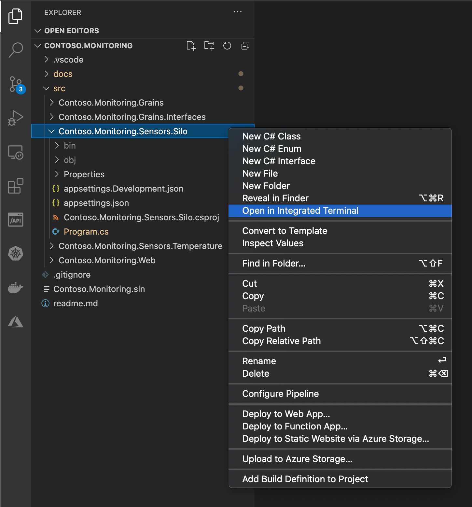
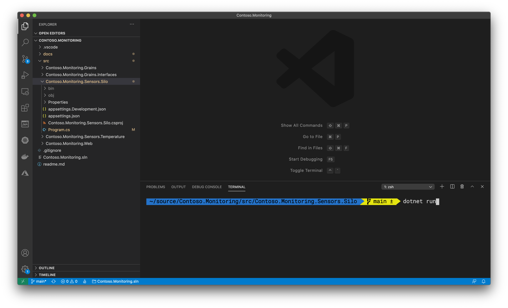
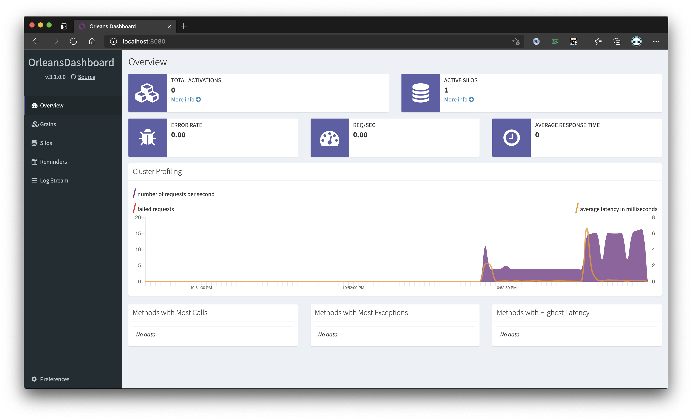

# Running the Orleans Silo

When a grain is activated in Orleans, the runtime decides which server (silo) to activate that grain on. This is called grain placement. The placement process in Orleans is fully configurable: developers can choose from a set of out-of-the-box placement policies such as random, prefer-local, and load-based, or custom logic can be configured. This allows for full flexibility in deciding where grains are created. For example, grains can be placed on a server close to resources which they need to operate on or close to other grains which they communicate with.

## Hosting the silo using a .NET Core Generic Host

The Contoso Monitoring solution has one silo, that is hosted using a .NET Core Generic Host. The `Program.cs`, including the dashboard setup, is under 30 lines of code, and is the only file C# in the `Contoso.Monitoring.Sensors.Silo` project. A trimmed version of this shows the single call to `UseOrleans`, in which the `SiloBuilder` is constructed. This is all the code required to host an Orleans silo.

```csharp
await Host
        .CreateDefaultBuilder(args)
        .UseOrleans(siloBuilder =>
        {
            siloBuilder
                .AddMemoryGrainStorage(name: "contosoMonitoringStore")
                .Configure<ClusterOptions>(options =>
                    {
                        options.ClusterId = "dev";
                        options.ServiceId = "ContosoMonitoring";
                    })
                .UseLocalhostClustering();

                // dashboard code will go here

        }).RunConsoleAsync();
```

## The Orleans Dashboarrd

The Orleans Dashboard is a part of the larger Orleans Contrib project, which contains many smaller contributions from the open-source community who extend Orleans in new and exciting ways. The `UseDashboard` extension method results in the dynamic generation and hosting of a web site that provides you a with a snapshot of the entire Orleans cluster. It allows you to see each instance of any type of Grain, and how all the objects in the system are distributed across the cluster. 

```csharp
.UseOrleans(siloBuilder =>
{
    siloBuilder
        .ConfigureApplicationParts(appParts => 
            appParts.AddApplicationPart(typeof(TemperatureSensorGrain).Assembly).WithReferences())
        .UseDashboard();
})
```

> Note: The Orleans Dashboard extension method requires the `AddApplicationPart` method be called to inform the dashbord of all the grains in the cluster. In most scenarios this isn't needed, but the Dashboard uses the `AddApplicationPart` method so we need to include it here.

## Start the Silo project

In Visual Studio Code (or from your terminal's command line), open a terminal into the `Contoso.Monitoring.Sensors.Silo` project directory. 



Once the terminal window is open (or you've CD'ed into the folder), enter the command `dotnet run` to start the Silo project and host the Orleans silo.



The Silo project will start up, showing you a bit of log data from the Orleans Silo's hosting process. Once the project is running, open a web browser to http://localhost:8080.



The Orleans cluster is empty at the moment, and not much is happening. In the next few steps you'll add a web app that serves as a client calling Grains hosted in the Orleans Silo, and you'll run multiple instances of a worker service that will serve as digital twins for temperature sensors in those monitored areas.

---

## Next Steps

Now that you have the Orleans Silo hosted in a .NET Core Generic Host you'll run an ASP.NET Core Blazor app that uses the Silo-hosted grain classes to provide a snapshot of the temperature sensors throughout a monitored building.

[Go to Phase 4](04-run-blazor-web-app.md)