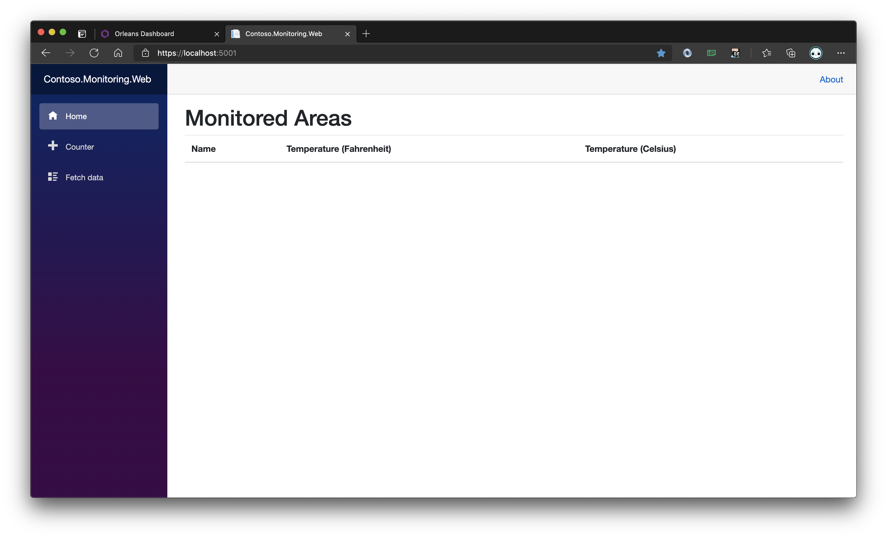

# Phase 4 - Connect an ASP.NET Core Web project to Orleans

One of the projects is a web-based table showing the various temperature sensors and their latest values. This ASP.NET Core Blazor project is named `Contoso.Monitoring.Web`. There are a few code changes you'll need to make that will call the Grains hosted in the Silo to get data to be displayed in the browser. 

## Adding code to the web app

The Web App will use an Orleans client to connect to the underlying silo running on `localhost`. Complete the following steps to perform this task.

1. Open the `ContosoMonitoringClientService.cs` file from the `Contoso.Monitoring.Grains` project. Add the following code to the class.

    ```csharp
    internal async Task<List<MonitoredArea>> GetMonitoredAreas()
    {
        return (await Client.GetGrain<IMonitoredBuildingGrain>(Guid.Empty).GetMonitoredAreas());
    }
    ```

1. Add a new file to `Contoso.Monitoring.Web` project named `ClusterWorker.cs`. The Cluster Worker service will provide a background service that will connect to the Silo when the web app starts, and disconnect when the web app stops. Paste the following code into the new `ClusterWorker.cs` file.

    ```csharp
    using System.Threading;
    using System.Threading.Tasks;
    using Microsoft.Extensions.Hosting;

    namespace Contoso.Monitoring.Web
    {
        public class ClusterWorker : IHostedService
        {
            private readonly ContosoMonitoringClientService _clusterService;

            public ClusterWorker(ContosoMonitoringClientService clusterService)
            {
                _clusterService = clusterService;
            }

            public async Task StartAsync(CancellationToken cancellationToken)
            {
                await _clusterService.Connect(cancellationToken);
            }

            public async Task StopAsync(CancellationToken cancellationToken)
            {
                await _clusterService.Stop(cancellationToken);
            }
        }
    }
    ```

1. In the `Contoso.Monitoring.Web` project's `Startup.cs` file, find the `ConfigureServices` method. Paste this code at the end of the method. This code will place an instance of the `ContosoMonitoringClientService` and the `ClusterWorker` `IHostedService` into the ASP.NET Core's IoC container. 

    ```csharp
    services.AddSingleton<ContosoMonitoringClientService>();
    services.AddHostedService<ClusterWorker>();
    ```

1. Open the `Pages/Index.razor` file. Add the line of code below the `@page` code to inject an instance of the `ContosoMonitoringClientService` class into the page at run-time.

    ```
    @page "/"
    @inject ContosoMonitoringClientService _contosoMonitoringClientService;
    ```

1. Paste in the `OnInitializedAsync` method into the `@code` block in the `Index.razor` page. This code will use the `_contosoMonitoringClientService` service injected earlier to get temperature sensor data from the Orleans Silo.

    ```csharp
    protected override async Task OnInitializedAsync()
    {
        _areas = await _contosoMonitoringClientService.GetMonitoredAreas();
    }
    ```

## Running the web app 

Using Visual Studio or Visual Studio Code, run the `Contoso.Monitoring.Web` project.

> Note: You don't need to close the already-running Silo project's active terminal window. Visual Studio Code supports multiple simultaneous terminal windows. 

When the browser opens you'll see the table that will include the list of temperature sensors. If the web browser doesn't automatically open, browse to http://localhostL:5000 to see it.



The web app is somewhat boring at the moment, but once the temperature sensors start feeding data into the silo the web app will start showing the incoming sensor data.

---

## Next Steps

With the Silo running and the Blazor web app running and ready to receive data, you'll run a few instances of the Temperature sensor worker to emulate physical sensors sending live data.

[Go to Phase 5](05-temperature-worker-service.md)