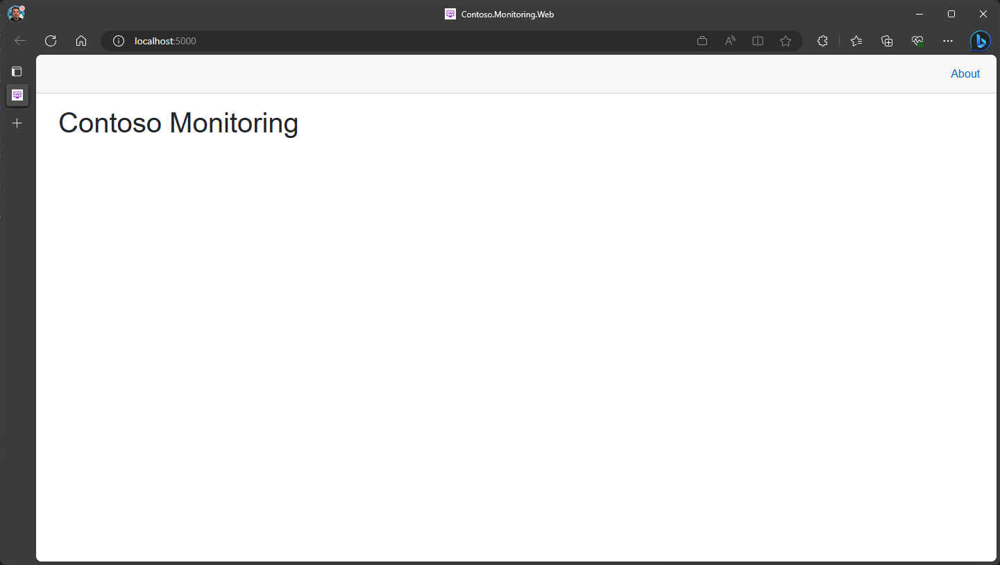

# Run the Blazor Web App

One of the projects is a web-based table showing the various temperature sensors and their latest values. This ASP.NET Core Blazor project is named `Contoso.Monitoring.Web`. If you're using Visual Studio Code, right-click the folder's project and open the integrated terminal. 

> Note: You don't need to close the already-running Silo project's active terminal window. Visual Studio Code supports multiple simultaneous terminal windows. 

Once again, type the command `dotnet run` to run the web project. If it doesn't automatically open, you can click the https://localhost:5001 link in the log output to open it in a browser. 

When the browser opens you'll see the table that will include the list of temperature sensors.

The web app is somewhat boring at the moment, but in the next step you'll connect the web app to the Orleans Silo and begin using the Orleans Grains hosted in the silo. 

---

## Next Steps

With the Silo running and the Blazor web app running and ready to receive data, you'll run a few instances of the Temperature sensor worker to emulate physical sensors sending live data.

[Go to Phase 5](05-temperature-worker-service.md)