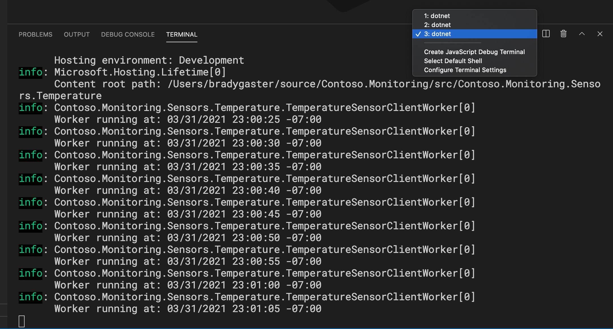

# The Temperature Sensor worker service 

In this phase of the tutorial you'll get the 
Devices hosting the temperature sensor app, a .NET Core worker service project, implement the `ITemperatureSensorClient` interface in the `Contoso.Monitoring.Sensors.Temperature ` project to add code specific to whatever type of temperature-sensing behavior the host device supports.

```csharp
namespace Contoso.Monitoring.Sensors.Temperature.Services
{
    public interface ITemperatureSensorClient
    {
        Task<TemperatureReading> GetTemperatureReading();
    }
}
```

The job of this interface is to give the `TemperatureSensorClientWorker` class a way to get the temperature from a wide variety of host devices or platforms. Implemented by the `FakeTemperatureSensorClient` class, the current implementation generates fake temperature readings that are sent to the `ITemperatureSensorGrain` running in the Microsoft Orleans silo.

```csharp
public class FakeTemperatureSensorClient : ITemperatureSensorClient
{
    private string _randomSensorName;

    public FakeTemperatureSensorClient()
    {
        _randomSensorName = string.Concat(new Random().Next(1,10), new Random().Next(1,50));
    }

    public Task<TemperatureReading> GetTemperatureReading()
    {
        var fakeTempInF = new Random().Next(60, 80); 

        return Task.FromResult(new TemperatureReading
        {
            SensorName = _randomSensorName,
            Fahrenheit = fakeTempInF,
            Celsius = TemperatureReadingConverter.ToCelsius(fakeTempInF)
        });
    }
}
```

## Run the temperature sensor emulator

In Visual Studio Code (or your own terimnal), open the `Contoso.Monitoring.Sensors.Temperature ` project in the terminal. 


Then, run the temperature worker service by entering `dotnet run` at the terminal prompt. 


The temperature worker will begin to send simulated temperature readings back to the Orleans Silo. To see the data being received by the Silo, switch the Visual Studio Code terminal being observed to the topmost one in the list, which is hosting the output from the Silo project. 

 

Once you select the Silo project, the output of the Silo can be seen as it receives data from the temperature sensor worker. 


## Simulate multiple temperature sensors

Now, start up more terminal instances - 4 or 5 or more - of the terminal window in the temperature sensor project. As you create more instances of the temperature sensor worker, check the Orleans dashboard at http://localhost:8080 to see the grain classes being created in the silo by each of the temperature client applications connecting to it. 


Note the "total activations" area in the top-left quadrant of the dashboard. Click that, and you'll see the grains that have been activated in the silo. 


If you want to see the performance of a specific grain being used across multiple clients or silos, click the grain's type name and you can see how the activations, failures, and API calls are working as the clients run. 


---

## Next Steps

That's the end of the exercise. In the next segment we'll have some Q&A. Thank you for your participation in the tutorial. 

[Question 1 (of 4)](question01.md)