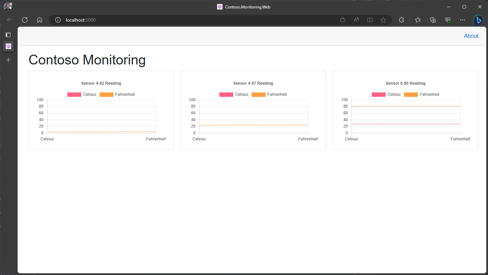

# Phase 5 - The Temperature Sensor worker service 

In this final phase of the tutorial, you'll get one or more instances of the `Contoso.Monitoring.Sensors.Temperature` running. Each instance of this app represents a single temperature sensor, like one you'd find in a ceiling or wall.

## Explore the "Simulation" Implementation

1. Open the `ITemperatureSensorClient.cs` file in the `Contoso.Monitoring.Sensors.Temperature` project. Note how it provides an abstraction around getting a temperature reading from a sensor.

1. Open the `FakeTemperatureSensorClient.cs` file from the `Contoso.Monitoring.Sensors.Temperature` project. This implementation basically provides a random temperature reading.

## Run the temperature sensor emulator

In Visual Studio or Visual Studio Code, run the `Contoso.Monitoring.Sensors.Temperature` project. 

The temperature worker will begin to send simulated temperature readings back to the Orleans Silo. To see the data being received by the Silo, switch the Visual Studio Code terminal being observed to the topmost one in the list, which is hosting the output from the Silo project. 

## Simulate multiple temperature sensors

Now, start up more terminal instances of the terminal window in the temperature sensor project. As you create more instances of the temperature sensor worker, check the Orleans dashboard at http://localhost:8080 to see the grain classes being created in the silo by each of the temperature client applications connecting to it. As well, if you refresh the Contoso Monitoring web page after you start each temperature sensor, you'll see each appear as an individual chart in the page.

---

## Next Steps

That's the end of the exercise. Thank you for your participation in the tutorial. 
